# [📈 Live Status](https://uptime.doda.dev): <!--live status--> **🟩 All systems operational**

This repository contains the open-source uptime monitor and status page for [doda.dev](https://uptime.doda.dev), powered by [Upptime](https://github.com/upptime/upptime).

With [Upptime](https://upptime.js.org), you can get your own unlimited and free uptime monitor and status page, powered entirely by a GitHub repository. We use [Issues](https://github.com/doda-dev/uptime/issues) as incident reports, [Actions](https://github.com/doda-dev/uptime/actions) as uptime monitors, and [Pages](https://uptime.doda.dev) for the status page.

<!--start: status pages-->
<!-- This summary is generated by Upptime (https://github.com/upptime/upptime) -->
<!-- Do not edit this manually, your changes will be overwritten -->
<!-- prettier-ignore -->
| URL | Status | History | Response Time | Uptime |
| --- | ------ | ------- | ------------- | ------ |
|  [doda.dev](https://doda.dev) | 🟩 Up | [doda-dev.yml](https://github.com/doda-dev/uptime/commits/HEAD/history/doda-dev.yml) | 

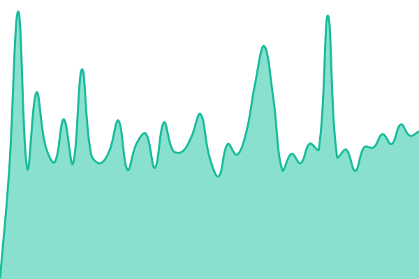 428ms
     
 | 

<a href="https://uptime.doda.dev/history/doda-dev">100.00%</a>
    

|  [wiki.doda.dev](https://wiki.doda.dev) | 🟩 Up | [wiki-doda-dev.yml](https://github.com/doda-dev/uptime/commits/HEAD/history/wiki-doda-dev.yml) | 

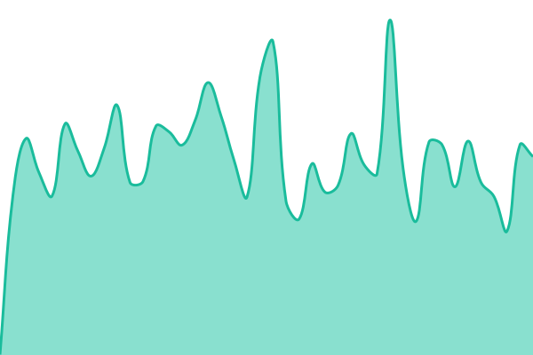 423ms
     
 | 

<a href="https://uptime.doda.dev/history/wiki-doda-dev">100.00%</a>
    

|  [Muzip site](https://muzip.xyz) | 🟩 Up | [muzip-site.yml](https://github.com/doda-dev/uptime/commits/HEAD/history/muzip-site.yml) | 

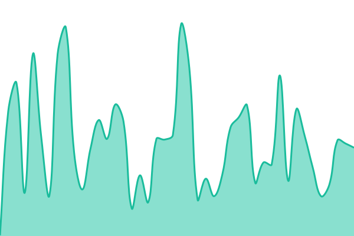 136ms
     
 | 

<a href="https://uptime.doda.dev/history/muzip-site">100.00%</a>
    

|  [Muzip API (Graph v2)](https://api-rd.muzip.xyz) | 🟩 Up | [muzip-api-graph-v2.yml](https://github.com/doda-dev/uptime/commits/HEAD/history/muzip-api-graph-v2.yml) | 

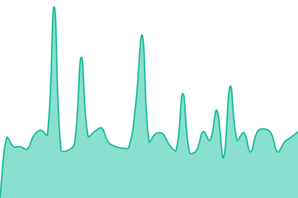 413ms
     
 | 

<a href="https://uptime.doda.dev/history/muzip-api-graph-v2">100.00%</a>
    

|  [Umami Analytics](https://umami.doda.dev) | 🟩 Up | [umami-analytics.yml](https://github.com/doda-dev/uptime/commits/HEAD/history/umami-analytics.yml) | 

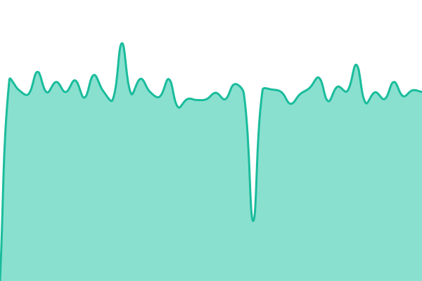 304ms
     
 | 

<a href="https://uptime.doda.dev/history/umami-analytics">100.00%</a>
    

|  [Vaultwarden](https://bitwarden.doda.dev) | 🟩 Up | [vaultwarden.yml](https://github.com/doda-dev/uptime/commits/HEAD/history/vaultwarden.yml) | 

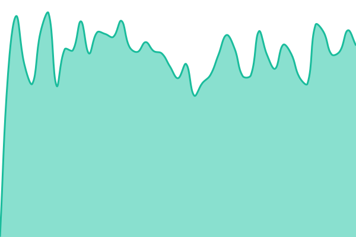 702ms
     
 | 

<a href="https://uptime.doda.dev/history/vaultwarden">100.00%</a>
    

|  [Vaultwarden Icon Proxy](https://bitwarden-icon.doda.dev/google.com/icon.png) | 🟩 Up | [vaultwarden-icon-proxy.yml](https://github.com/doda-dev/uptime/commits/HEAD/history/vaultwarden-icon-proxy.yml) | 

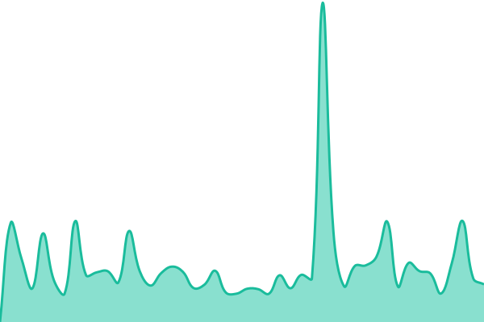 492ms
     
 | 

<a href="https://uptime.doda.dev/history/vaultwarden-icon-proxy">100.00%</a>
    

|  [ha.ddark.kr](https://ha.ddark.kr/status) | 🟩 Up | [ha-ddark-kr.yml](https://github.com/doda-dev/uptime/commits/HEAD/history/ha-ddark-kr.yml) | 

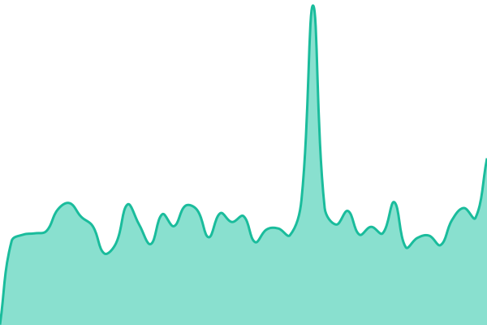 294ms
     
 | 

<a href="https://uptime.doda.dev/history/ha-ddark-kr">100.00%</a>
    

|  [static.doda.im](https://static.doda.im/status) | 🟩 Up | [static-doda-im.yml](https://github.com/doda-dev/uptime/commits/HEAD/history/static-doda-im.yml) | 

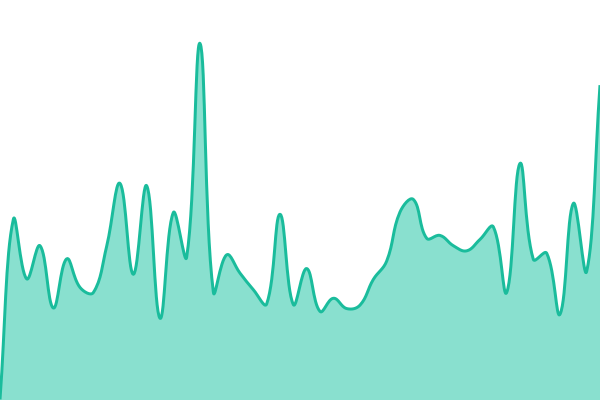 224ms
     
 | 

<a href="https://uptime.doda.dev/history/static-doda-im">100.00%</a>
    

|  [Doda DNS (HTTPS)](https://dns.doda.im/dns-query) | 🟩 Up | [doda-dns-https.yml](https://github.com/doda-dev/uptime/commits/HEAD/history/doda-dns-https.yml) | 

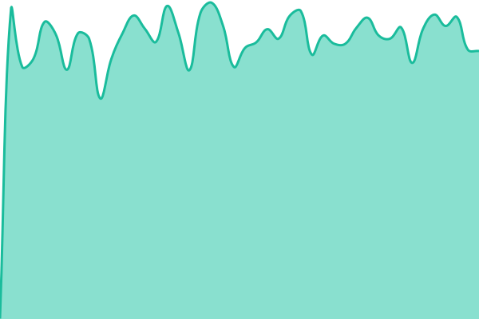 662ms
     
 | 

<a href="https://uptime.doda.dev/history/doda-dns-https">100.00%</a>
    

|  [Doda DNS (TLS)](dns.doda.im) | 🟩 Up | [doda-dns-tls.yml](https://github.com/doda-dev/uptime/commits/HEAD/history/doda-dns-tls.yml) | 

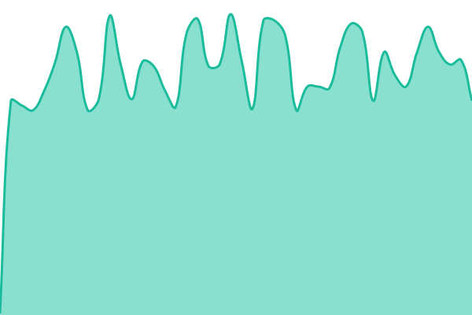 159ms
     
 | 

<a href="https://uptime.doda.dev/history/doda-dns-tls">100.00%</a>
    

<!--end: status pages-->

[**Visit our status website →**](https://uptime.doda.dev)

## 📄 License

- Powered by: [Upptime](https://github.com/upptime/upptime)
- Code: [MIT](./LICENSE) © [doda.dev](https://uptime.doda.dev)
- Data in the `./history` directory: [Open Database License](https://opendatacommons.org/licenses/odbl/1-0/)
