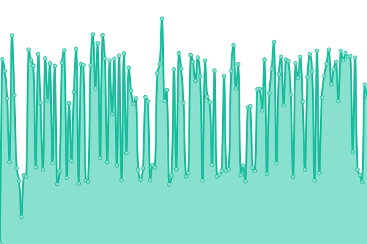
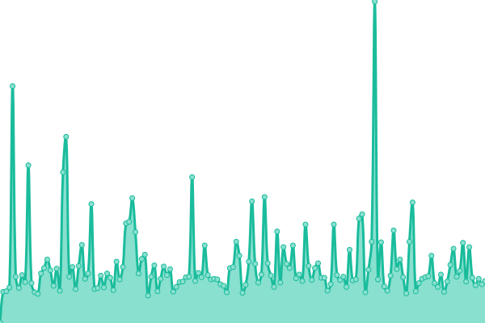
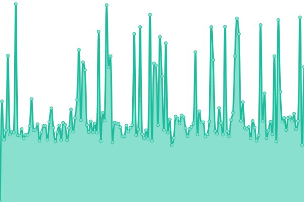
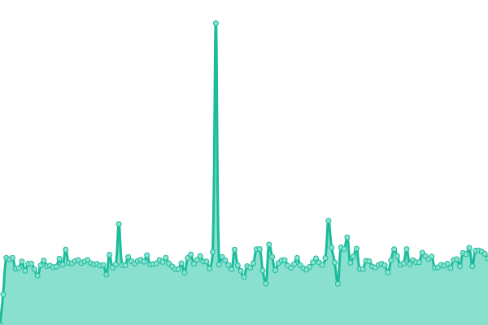
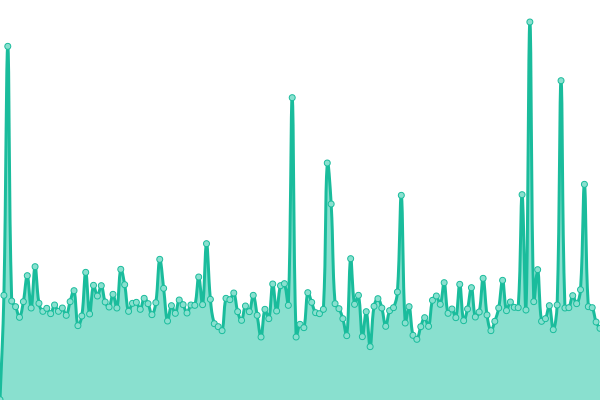

# [📈 Live Status](https://uptime.doda.dev): <!--live status--> **🟩 All systems operational**

This repository contains the open-source uptime monitor and status page for [doda.dev](https://uptime.doda.dev), powered by [Upptime](https://github.com/upptime/upptime).

With [Upptime](https://upptime.js.org), you can get your own unlimited and free uptime monitor and status page, powered entirely by a GitHub repository. We use [Issues](https://github.com/doda-dev/uptime/issues) as incident reports, [Actions](https://github.com/doda-dev/uptime/actions) as uptime monitors, and [Pages](https://uptime.doda.dev) for the status page.

<!--start: status pages-->
<!-- This summary is generated by Upptime (https://github.com/upptime/upptime) -->
<!-- Do not edit this manually, your changes will be overwritten -->
<!-- prettier-ignore -->
| URL | Status | History | Response Time | Uptime |
| --- | ------ | ------- | ------------- | ------ |
|  [doda.dev](https://doda.dev) | 🟩 Up | [doda-dev.yml](https://github.com/doda-dev/uptime/commits/HEAD/history/doda-dev.yml) | 

 130ms
     
 | 

<a href="https://uptime.doda.dev/history/doda-dev">100.00%</a>
    

|  [Muzip site](https://muzip.xyz) | 🟩 Up | [muzip-site.yml](https://github.com/doda-dev/uptime/commits/HEAD/history/muzip-site.yml) | 

 103ms
     
 | 

<a href="https://uptime.doda.dev/history/muzip-site">100.00%</a>
    

|  [Muzip API (Graph v2)](https://api-rd.muzip.xyz) | 🟩 Up | [muzip-api-graph-v2.yml](https://github.com/doda-dev/uptime/commits/HEAD/history/muzip-api-graph-v2.yml) | 

 457ms
     
 | 

<a href="https://uptime.doda.dev/history/muzip-api-graph-v2">100.00%</a>
    

|  [dodaGit](https://git.doda.dev) | 🟩 Up | [doda-git.yml](https://github.com/doda-dev/uptime/commits/HEAD/history/doda-git.yml) | 

 734ms
     
 | 

<a href="https://uptime.doda.dev/history/doda-git">100.00%</a>
    

|  [Matomo (Analytics)](https://matomo.doda.dev) | 🟩 Up | [matomo-analytics.yml](https://github.com/doda-dev/uptime/commits/HEAD/history/matomo-analytics.yml) | 

 1441ms
     
 | 

<a href="https://uptime.doda.dev/history/matomo-analytics">100.00%</a>
    

|  [Vaultwarden](https://bitwarden.doda.dev) | 🟩 Up | [vaultwarden.yml](https://github.com/doda-dev/uptime/commits/HEAD/history/vaultwarden.yml) | 

 555ms
     
 | 

<a href="https://uptime.doda.dev/history/vaultwarden">100.00%</a>
    

|  [Vaultwarden Icon Proxy](https://bitwarden-icon.doda.dev/google.com/icon.png) | 🟩 Up | [vaultwarden-icon-proxy.yml](https://github.com/doda-dev/uptime/commits/HEAD/history/vaultwarden-icon-proxy.yml) | 

 175ms
     
 | 

<a href="https://uptime.doda.dev/history/vaultwarden-icon-proxy">100.00%</a>
    

|  [Static (global)](https://static.doda.dev/hello) | 🟩 Up | [static-global.yml](https://github.com/doda-dev/uptime/commits/HEAD/history/static-global.yml) | 

 146ms
     
 | 

<a href="https://uptime.doda.dev/history/static-global">100.00%</a>
    

|  [serve (legacy)](https://serve.ddark.kr) | 🟩 Up | [serve-legacy.yml](https://github.com/doda-dev/uptime/commits/HEAD/history/serve-legacy.yml) | 

 321ms
     
 | 

<a href="https://uptime.doda.dev/history/serve-legacy">100.00%</a>
    

|  [ha.ddark.kr](https://ha.ddark.kr/status) | 🟩 Up | [ha-ddark-kr.yml](https://github.com/doda-dev/uptime/commits/HEAD/history/ha-ddark-kr.yml) | 

 326ms
     
 | 

<a href="https://uptime.doda.dev/history/ha-ddark-kr">100.00%</a>
    

|  [Doda Mail Server (Web)](https://mail.doda.dev) | 🟩 Up | [doda-mail-server-web.yml](https://github.com/doda-dev/uptime/commits/HEAD/history/doda-mail-server-web.yml) | 

 464ms
     
 | 

<a href="https://uptime.doda.dev/history/doda-mail-server-web">100.00%</a>
    

|  [Doda Mail Server (IMAP)](mail.doda.dev) | 🟩 Up | [doda-mail-server-imap.yml](https://github.com/doda-dev/uptime/commits/HEAD/history/doda-mail-server-imap.yml) | 

 143ms
     
 | 

<a href="https://uptime.doda.dev/history/doda-mail-server-imap">100.00%</a>
    

|  [Guacamole](https://guac.doda.dev/api/languages) | 🟩 Up | [guacamole.yml](https://github.com/doda-dev/uptime/commits/HEAD/history/guacamole.yml) | 

 561ms
     
 | 

<a href="https://uptime.doda.dev/history/guacamole">100.00%</a>
    

<!--end: status pages-->

[**Visit our status website →**](https://uptime.doda.dev)

## 📄 License

- Powered by: [Upptime](https://github.com/upptime/upptime)
- Code: [MIT](./LICENSE) © [doda.dev](https://uptime.doda.dev)
- Data in the `./history` directory: [Open Database License](https://opendatacommons.org/licenses/odbl/1-0/)
